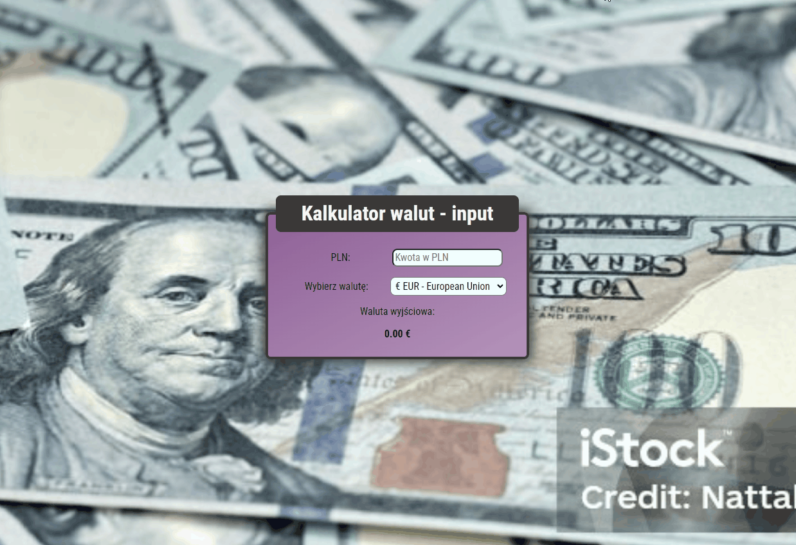

# Mateusz Burak - simple currency converter using *input*

## Currency converter - input - April 29th, 2023

[Link to the converter](https://mateuszburak.github.io/currency-converter-input/) |
[Link to the converter's repository](https://github.com/MateuszBurak/currency-converter-input)

This converter converts currency values from PLN to EUR, USD and GBP. It follows BEM convention.

## How to use

To use it, simply input the amount and choose the currency you want the outcome to be in.

## Code

Since this simple converter does not use api, as it's mostly meant to practice the *input* element, it uses convertion data from early 2023.

It uses ES6+ features.